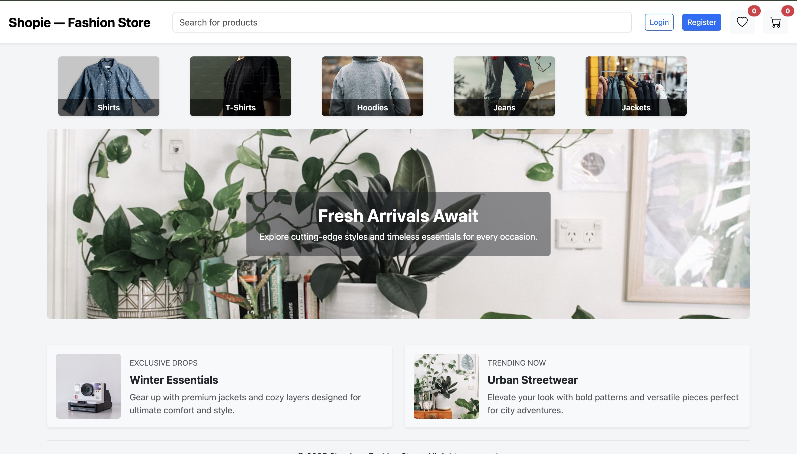
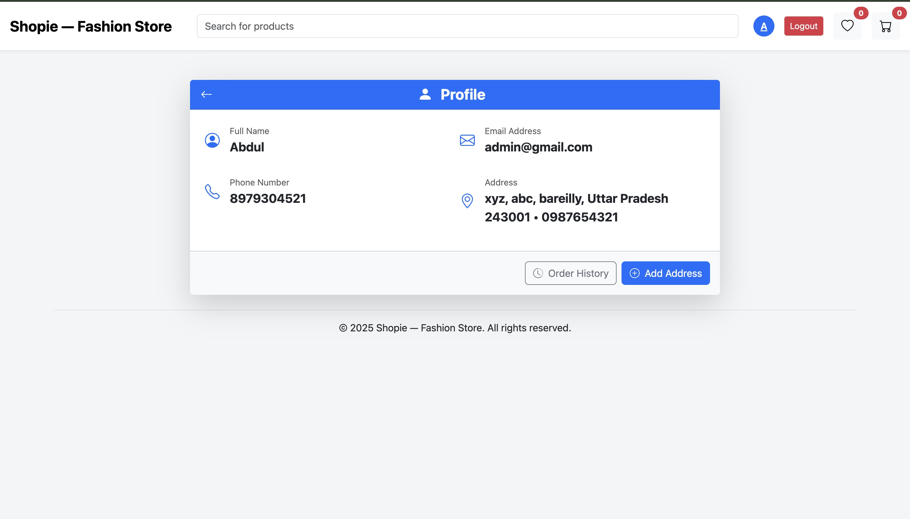
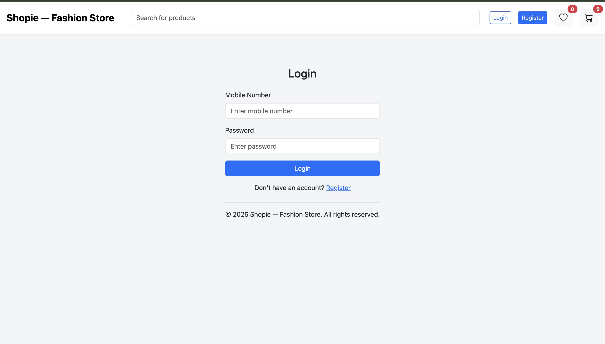
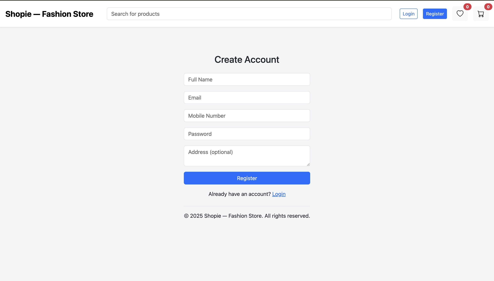
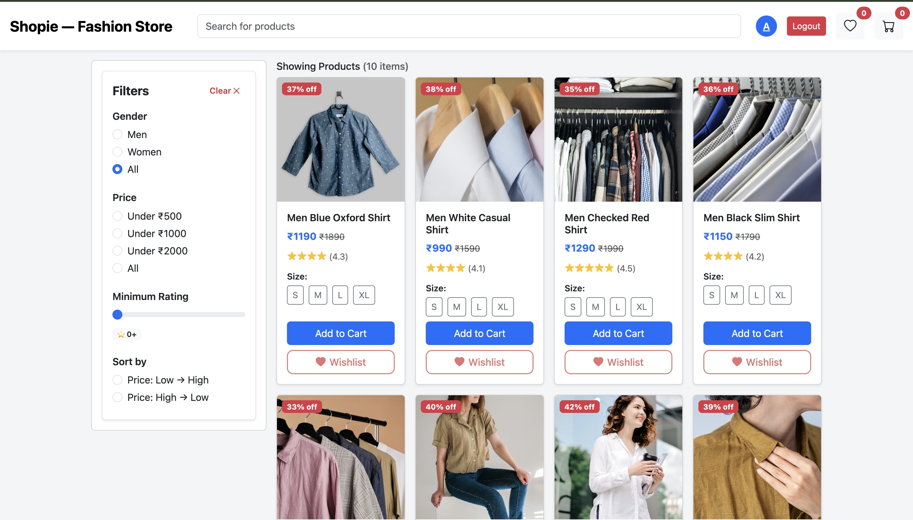
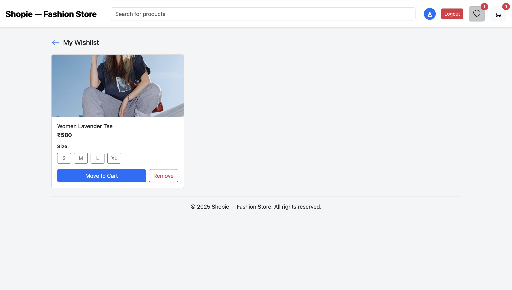
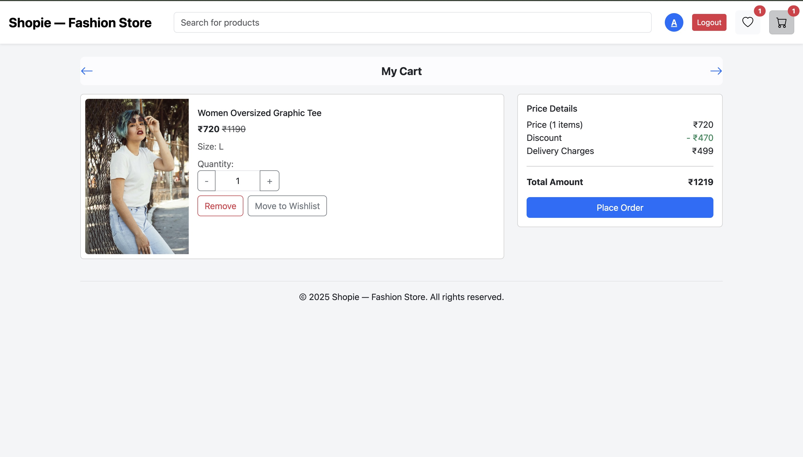
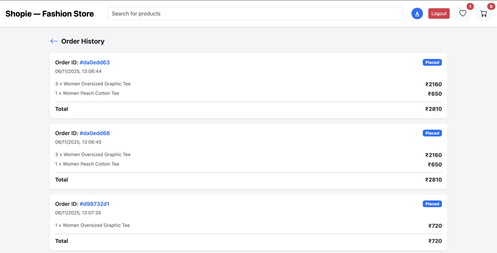

# 🛍️ MyShopieApp — Full-Stack E-Commerce Web Application

MyShopieApp is a modern and responsive **E-Commerce platform** built using **React (Vite)**, **Node.js**, **Express**, and **MongoDB**.  
It provides users with a smooth online shopping experience including authentication, cart, wishlist, checkout, address management, and order tracking.

---

## 🌍 Live Deployment

| Service        | Link                                 |
| -------------- | ------------------------------------ |
| 🖥️ Frontend    | https://my-shopie-app-001.vercel.app |
| ⚙️ Backend API | https://my-shopie-app.vercel.app     |

---

## 🔐 Demo Login (For Testing)

```
📱 Mobile Number: 1234567890
🔑 Password: 123@Demo
```

---

## 📸 UI Preview

| Home                                  | Profile                                     |
| ------------------------------------- | ------------------------------------------- |
|  |  |

| Login                                   | Registration                                          |
| --------------------------------------- | ----------------------------------------------------- |
|  |  |

| Product                                      |
| -------------------------------------------- |
|  |

| Wishlist                                      | Cart                                  |
| --------------------------------------------- | ------------------------------------- |
|  |  |

| Checkout                                      | Orders                                    |
| --------------------------------------------- | ----------------------------------------- |
|  |  |

---

## ✨ Features

### 👤 Authentication

- Register / Login / Logout
- JWT-secured session validation
- Restricted access (Wishlist, Checkout, Orders)

### 🛒 Shopping System

- Browse products by category & filters
- View product details with selectable sizes
- Add / Remove items from Cart
- Add / Remove items from Wishlist
- Move items between Cart ↔ Wishlist
- Quantity increment/decrement in Cart

### 🔍 Smart Search & Filters

- Search by title/keyword
- Filter by:
  - Category
  - Price
  - Rating
- Sorting (Low → High / High → Low)

### 📦 Order & Delivery System

- Manage multiple delivery addresses
- Checkout with saved address
- Order history and order detail pages

### ❤️ Wishlist

- Persisted wishlist storage
- One-click move to cart

---

## 🧰 Tech Stack

### Frontend

| Tool         | Purpose          |
| ------------ | ---------------- |
| React (Vite) | UI Framework     |
| Bootstrap    | Layout + Styling |
| React Router | Navigation       |
| Axios        | API Calls        |
| Context API  | Global State     |

### Backend

| Tool               | Purpose                 |
| ------------------ | ----------------------- |
| Node.js + Express  | API Framework           |
| MongoDB + Mongoose | Database                |
| JWT                | Authentication          |
| bcrypt             | Secure Password Hashing |
| CORS               | Frontend Communication  |

---

## 📁 Project Structure

```
MyShopieApp/
│
├── client/                     # Frontend
│   ├── src/
│   │   ├── components/
│   │   ├── pages/
│   │   ├── context/
│   │   ├── services/
│   │   ├── App.jsx
│   │   ├── main.jsx
│
├── server/                     # Backend
│   ├── controllers/
│   ├── middlewares/
│   ├── models/
│   ├── routes/
│   ├── config/
│   ├── index.js
│
└── README.md
```

---

## ⚙️ Installation

### Backend Setup

```sh
cd server
npm install
```

Create `.env` file in `/server`:

```
JWT_SECRET=YOUR_SECRET_KEY
DB_URI=YOUR_MONGODB_CONNECTION
PORT=3000
```

Start backend:

```sh
npm run dev
```

---

### Frontend Setup

```sh
cd client
npm install
npm run dev
```

---

## 📡 API Endpoints Summary

| Feature          | Method                    | Endpoint                                 |
| ---------------- | ------------------------- | ---------------------------------------- |
| Login / Register | POST                      | `/api/users/login` `/api/users/register` |
| Products         | GET                       | `/api/products`                          |
| Single Product   | GET                       | `/api/products/:productId`               |
| Cart             | GET / POST / PUT / DELETE | `/api/cart`                              |
| Wishlist         | GET / POST / DELETE       | `/api/wishlist`                          |
| Orders           | GET / POST                | `/api/orders`                            |
| Addresses        | GET / POST / PUT / DELETE | `/api/address`                           |

---

## 🚀 Roadmap

- ☐ Admin Dashboard (Manage Products & Orders)
- ☐ Reviews & Ratings System
- ☐ Online Payment Integration (Stripe/Razorpay)
- ☐ Dark Mode
- ☐ Push Notifications

---

## 🤝 Contribution Guide

```sh
git checkout -b feature-name
git commit -m "feat: added new feature"
git push origin feature-name
```

---

## 🧑‍💻 Author

**Abdul Kalam**  
🔗 GitHub Profile: https://github.com/Abdul-Kalam0

---

## 📄 License

This project is released under the **MIT License**.

---

### ⭐ If you like this project, consider giving a **GitHub Star**!

Made with ❤️ by Abdul Kalam
